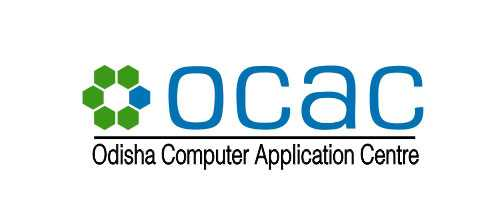
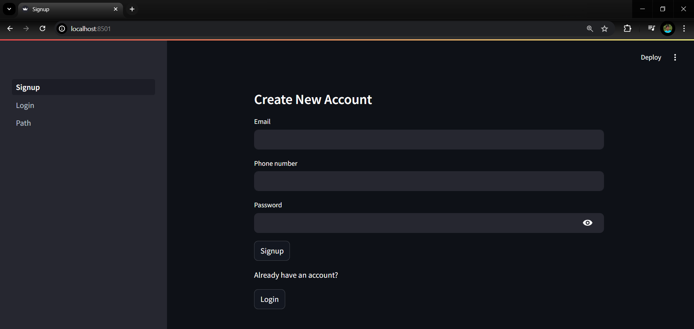
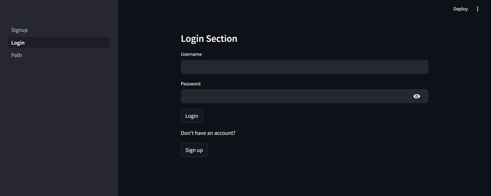
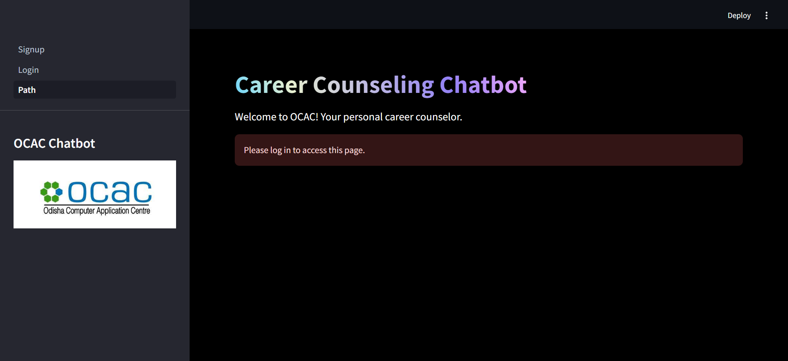
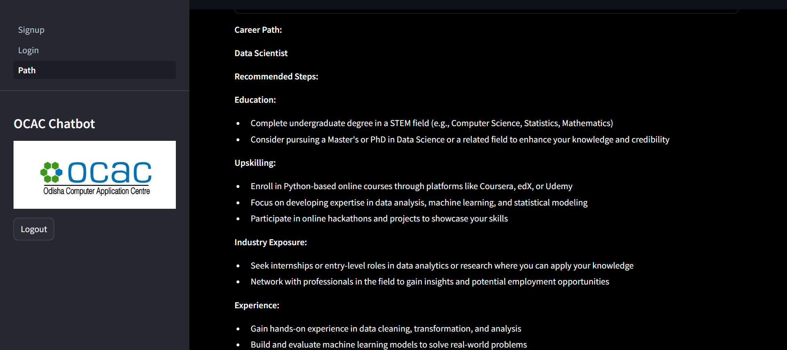

# OCAC Chatbot

This is a career counseling chatbot designed to provide personalized career advice based on the education of the student. It integrates Google Generative AI SDK for generating responses based on multiple inputs.

Make sure to download `wkhtmltopdf` from [this link](https://github.com/JazzCore/python-pdfkit/wiki/Installing-wkhtmltopdf) and add the `bin` folder path to your environment variables. This allows the career path to be downloaded and also sent to the email as an attachment.

## Features

- Personalized career advice based on user input.
- Integration with Google Generative AI SDK for generating responses.
- User authentication (separate signup, login pages available).
- Career path sent as email attachment (pdf).
- Easy deployment using Streamlit.

## Usage
- Sign Up: Open the app and create a new account using the sign-up page.
- Log In: Use your credentials to log in to the app.
- Career Path: Enter your educational background and other relevant details to receive personalized career advice.
- Email Attachment: Get the career path pdf via email.

## Screenshots

### Sign Up Page

### Login Page

### Career Advice Page

.png)

